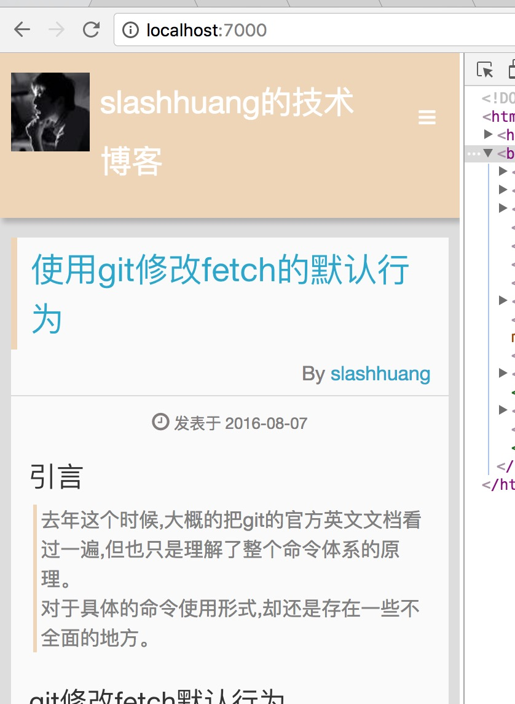
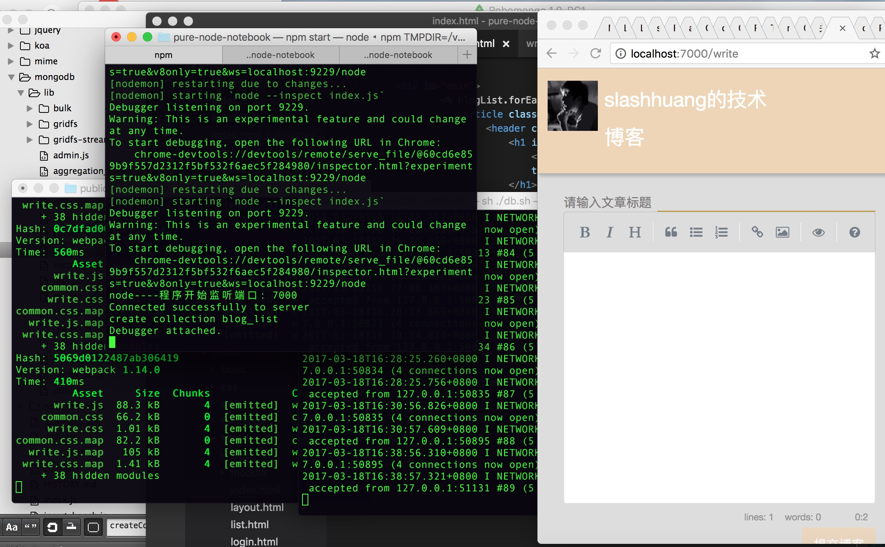

# pure-node-notebook

## 项目代码要求

> 纯Node 6.10.0支持的代码，不依赖于babel

> 依赖于任何第三方框架，纯手写Node框架及中间件

> 所有语法都在Node.green下的支持列表

## 运行代码

```bash
	git clone https://github.com/slashhuang/pure-node-notebook.git
	npm install 
	npm start
```


## 课件代码

1. 第一课: 创建一个简单的服务器

> 知识点: http请求。 ES6语法。 端口号。 commonJS模块体系。

```bash
	git checkout lesson-1
```


2. 第二课: 创建静态资源html、js返回

> 知识点: fs模块。 http请求对象分析。

```bash
	git checkout lesson-2
```


3. 第三-五课: 学习Promise来架构网站中间件 

> 知识点: Promise。 程序设计模式 。  http请求对象分析
```bash
	git checkout lesson-3-5
```



4. 第六-10课: 使用webpack架构前端、采用mongodb作为数据库

> 知识点: Promise、设计模式、mongodb、webpack
```bash
	git checkout lesson5-10
```



## 项目依赖

- [mime](https://github.com/broofa/node-mime)

- [ejs](https://github.com/mde/ejs)

- [simplemde](https://github.com/NextStepWebs/simplemde-markdown-editor/)

- [mongodb](http://mongodb.github.io/node-mongodb-native/2.2/quick-start/quick-start/)
