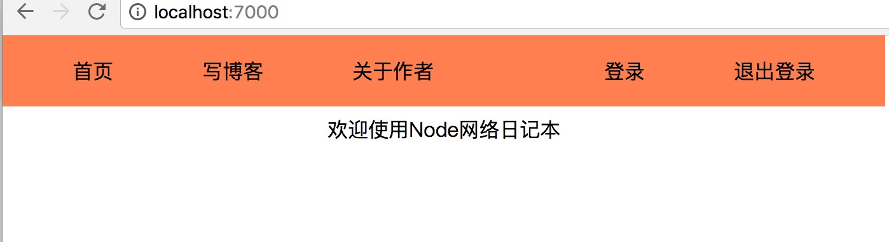

# pure-node-notebook

## 项目代码要求

> 纯Node 6.10.0支持的代码，不依赖于babel

> 不依赖于任何第三方库，纯手写Node组件

> 所有语法都在Node.green下的支持列表

## 运行代码

```bash
	git clone https://github.com/slashhuang/pure-node-notebook.git
	npm install 
	npm start
```


## 课件代码

1. 第一课: 创建一个简单的服务器

> 知识点: http请求。 ES6语法。 端口号。 commonJS模块体系。

```bash
	git checkout lesson-1
```


2. 第二课: 创建静态资源html、js返回

> 知识点: fs模块。 http请求对象分析。

```bash
	git checkout lesson-2
```


3. 第三课: 学习Promise来处理异步 http request

> 知识点: Promise。 http请求对象分析


